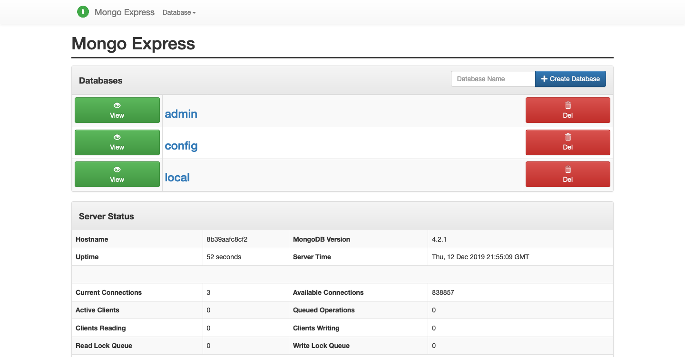

# Mongo Express (Mongo)

## Code

---

> [docker-compose.yml](docker-compose.yml):

```yaml

```

> [.env](.env):

```

```

> Load database:

```
$ docker-compose up -d
$ docker-compose ps
    Name                   Command               State            Ports          
---------------------------------------------------------------------------------
mongo           docker-entrypoint.sh mongod      Up      0.0.0.0:27017->27017/tcp
mongo-express   tini -- /docker-entrypoint ...   Up      0.0.0.0:8081->8081/tcp
```

## Interfaces

---

> [http://localhost:8081](http://localhost:8081):



## References

---

- [mongo-express/mongo-express](https://github.com/mongo-express/mongo-express)
- [MongoDB Tools - Mongo Express](http://mongodb-tools.com/tool/mongo-express/)
- Docker
  - [https://hub.docker.com/\_/mongo](https://hub.docker.com/_/mongo)
  - [https://hub.docker.com/\_/mongo-express](https://hub.docker.com/_/mongo-express)