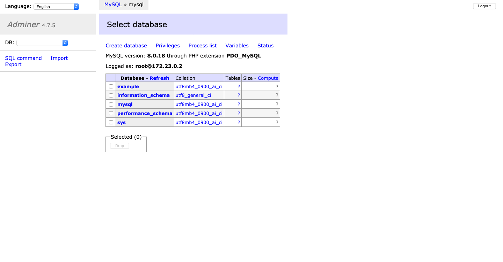

# Adminer (MySQL)

## Codes

---

> [docker-compose.yml](docker-compose.yml):

```yaml

```

> [.env](.env):

```

```

> Load database:

```
$ docker-compose up -d
$ docker-compose ps
 Name                Command               State                 Ports              
------------------------------------------------------------------------------------
adminer   entrypoint.sh docker-php-e ...   Up      0.0.0.0:8080->8080/tcp           
mysql     docker-entrypoint.sh --def ...   Up      0.0.0.0:3306->3306/tcp, 33060/tcp
```

## Interfaces

---

> [http://localhost:8080](http://localhost:8080):


> [http://localhost:8080/?server=mysql&username=root](http://localhost:8080/?server=mysql&username=root):



## References

---

- Docker
  - [https://hub.docker.com/\_/adminer](https://hub.docker.com/_/adminer)
  - [https://hub.docker.com/\_/mysql](https://hub.docker.com/_/mysql)