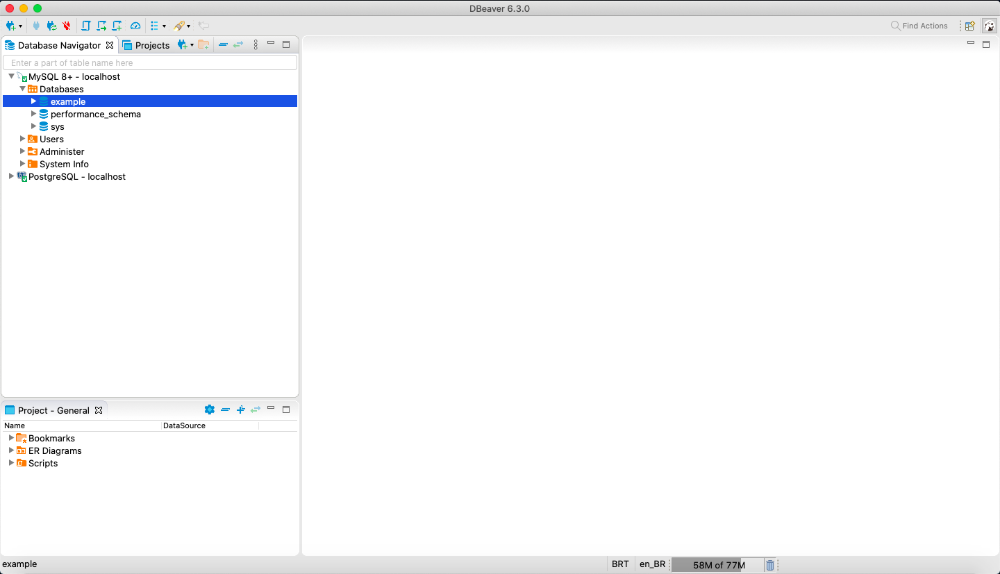

# MYSQL Client (MySQL)

## Code

---

> [docker-compose.yml](docker-compose.yml):

```yaml

```

> [.env](.env):

```

```

> Load database:

```
$ docker-compose up -d
$ docker-compose ps
 Name                Command               State                 Ports              
------------------------------------------------------------------------------------
mysql     docker-entrypoint.sh --def ...   Up      0.0.0.0:3306->3306/tcp, 33060/tcp
```

## Commands

---

> `mysql -u <username> -p`:

```
$ docker-compose exec mysql mysql -u root -p
Enter password: 
Welcome to the MySQL monitor.  Commands end with ; or \g.
Your MySQL connection id is 10
Server version: 8.0.18 MySQL Community Server - GPL

Copyright (c) 2000, 2019, Oracle and/or its affiliates. All rights reserved.

Oracle is a registered trademark of Oracle Corporation and/or its
affiliates. Other names may be trademarks of their respective
owners.

Type 'help;' or '\h' for help. Type '\c' to clear the current input statement.

mysql> 
```

> `show databases;`:

```
mysql> show databases;
+--------------------+
| Database           |
+--------------------+
| example            |
| information_schema |
| mysql              |
| performance_schema |
| sys                |
+--------------------+
5 rows in set (0.00 sec)
```

> `quit (\q)`:

```
mysql> quit
Bye
```

| Command           | Description                    |
| ----------------- | ------------------------------ |
| `\q`, `\e`        | Quit                           |
| `\h`, `?`         | Display help                   |
| `\u`              | Use another database           |

## Database Administration Tool

---

> DBeaver:



## References

---

- Docker
  - [https://hub.docker.com/\_/adminer](https://hub.docker.com/_/adminer)
  - [https://hub.docker.com/\_/mysql](https://hub.docker.com/_/mysql)
- Cheat Sheet
  - [Devhints](https://devhints.io/mysql)
  - [bradtraversy/mysql_cheat_sheet.md](https://gist.github.com/bradtraversy/c831baaad44343cc945e76c2e30927b3)
  - [hofmannsven/README.md](https://gist.github.com/hofmannsven/9164408)
