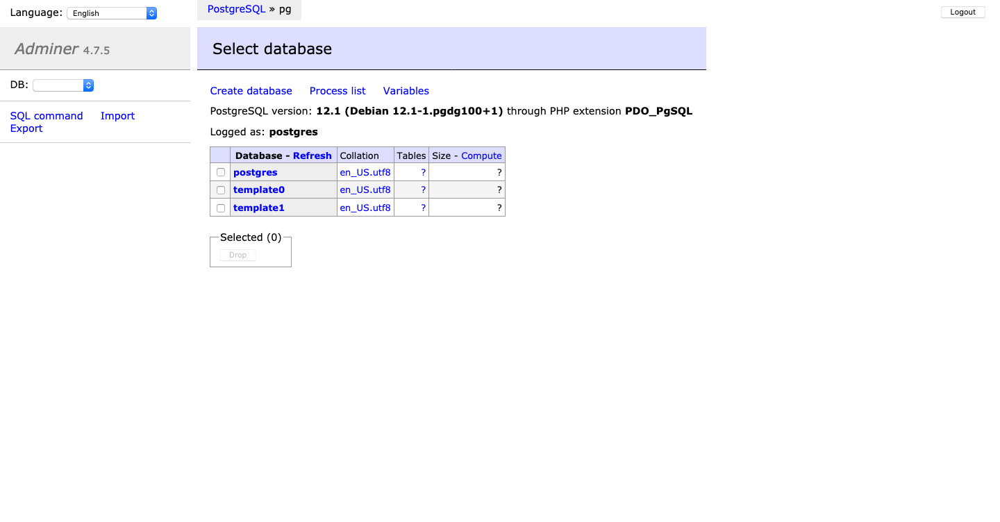

# Adminer (Postgres)

## Codes

---

> [docker-compose.yml](docker-compose.yml):

```yaml

```

> [.env](.env):

```

```

> Load database:

```
$ docker-compose up -d
$ docker-compose ps   
 Name                Command               State           Ports         
-------------------------------------------------------------------------
adminer   entrypoint.sh docker-php-e ...   Up      0.0.0.0:8080->8080/tcp
pg        docker-entrypoint.sh postgres    Up      0.0.0.0:5432->5432/tcp
```

## Interfaces

---

> [http://localhost:8080](http://localhost:8080):


> [http://localhost:8080/?pgsql=pg&username=postgres](http://localhost:8080/?pgsql=pg&username=postgres):



## References

---

- Docker
  - [https://hub.docker.com/\_/postgres](https://hub.docker.com/_/postgres)
  - [https://hub.docker.com/\_/adminer](https://hub.docker.com/_/adminer)