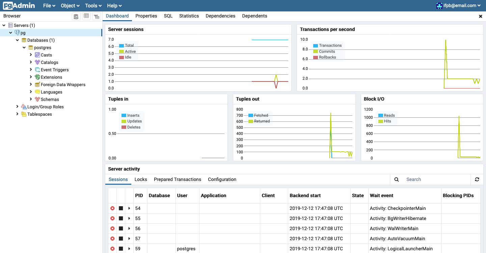

# pgAdmin4 (Postgres)

## Codes

---

> [docker-compose.yml](docker-compose.yml):

```yaml

```

> [.env](.env):

```

```

> Load database:

```
$ docker-compose up -d
$ docker-compose ps   
 Name                Command              State               Ports            
-------------------------------------------------------------------------------
pg        docker-entrypoint.sh postgres   Up      0.0.0.0:5432->5432/tcp       
pgadmin   /entrypoint.sh                  Up      443/tcp, 0.0.0.0:8080->80/tcp
```

## Interfaces

---

> [http://localhost:8080](http://localhost:8080):


> [http://localhost:8080/browser/#](http://localhost:8080/browser/#):



## References

---

- Docker
  - [https://hub.docker.com/\_/postgres](https://hub.docker.com/_/postgres)
  - [https://hub.docker.com/r/dpage/pgadmin4/](https://hub.docker.com/r/dpage/pgadmin4/)