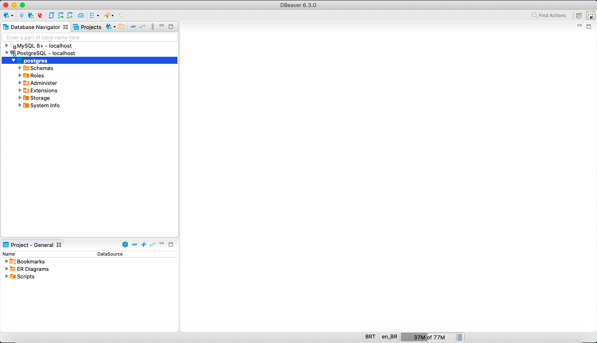

# PSQL (Postgres)

## Code

---

> [docker-compose.yml](docker-compose.yml):

```yaml

```

> [.env](.env):

```

```

> Load database:

```
$ docker-compose up -d
$ docker-compose ps
 Name                Command              State               Ports
-------------------------------------------------------------------------------
pg        docker-entrypoint.sh postgres   Up      0.0.0.0:5432->5432/tcp
```

## Commands

---

> `psql -h <hostname> -U <username>`:

```
$ docker-compose exec pg psql -h pg -U postgres
Password for user postgres:
psql (12.1 (Debian 12.1-1.pgdg100+1))
Type "help" for help.

postgres=#
```

> `\l`:

```
postgres=# \l
                                 List of databases
   Name    |  Owner   | Encoding |  Collate   |   Ctype    |   Access privileges
-----------+----------+----------+------------+------------+-----------------------
 postgres  | postgres | UTF8     | en_US.utf8 | en_US.utf8 |
 template0 | postgres | UTF8     | en_US.utf8 | en_US.utf8 | =c/postgres          +
           |          |          |            |            | postgres=CTc/postgres
 template1 | postgres | UTF8     | en_US.utf8 | en_US.utf8 | =c/postgres          +
           |          |          |            |            | postgres=CTc/postgres
(3 rows)
```

> `\q`:

```
postgres=# \q
```

| Command           | Description                    |
| ----------------- | ------------------------------ |
| `\q`              | Quit                           |
| `\l`              | List databases                 |
| `\c __database__` | Connect to a database          |
| `\d __table__`    | Show table                     |
| `\d+ __table__`   | More detailed table definition |
| `\dt *.*`         | List tables from all schemas   |
| `\du`             | List users                     |

## Database Administration Tool

---

> DBeaver:



## References

---

- Docker
  - [https://hub.docker.com/\_/postgres](https://hub.docker.com/_/postgres)
- Cheat Sheet
  - [postgresqltutorial](http://www.postgresqltutorial.com/postgresql-cheat-sheet/)
  - [Kartones/postgres-cheatsheet.md](https://gist.github.com/Kartones/dd3ff5ec5ea238d4c546)
